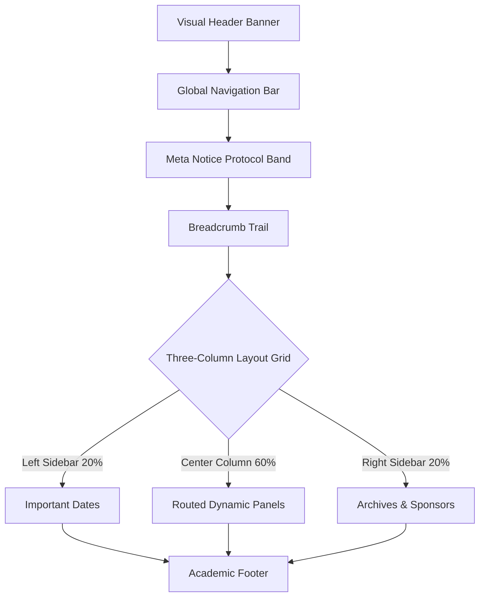

# CHI 2060 와이어프레임 레이아웃 및 텍스트 문구 명세서 (Specifications)

본 명세서는 **CHI 2060**의 가상 레포지토리에 저장된 원천 데이터(JSON Data Dump)를 바탕으로, 미래의 지능 에이전트들이 사용자(인간 또는 서브 에이전트)의 환경에 맞춰 웹페이지 디자인을 동적 렌더링(클래식, 네온/화려함, 극단적 미니멀리즘 등)할 때 반드시 준수해야 하는 **공통 와이어프레임 구조와 필수 텍스트 규격**을 정리한 개발 참고서입니다.

---

## 1. 글로벌 레이아웃 골격 (Wireframe Frame)

에이전트가 어떤 테마로 페이지를 생성하든, 정보의 구조적 전달을 위해 아래의 그리드 시스템과 구획(Section)을 유지해야 합니다.

### [필수 레이아웃 블록]
1.  **Visual Header Banner (상단 비주얼 배너)**: 비주얼 요소와 메인 학회명 타이포그래피 노출 영역.
2.  **Global Navigation Bar (메뉴 바)**: 6개의 메뉴 탭 라우팅 버튼과 우측의 `HUMAN UI | AGENT RAW DATA` 모드 스위치가 배치되는 영역.
3.  **Meta Notice Band (메타 안내 띠)**: 스펙큘러티브 컨셉의 핵심인 데이터 덤프 파싱 경고 띠.
4.  **Three-Column Grid (3열 본문 그리드)**:
    *   **좌측 열 (Important Dates)**: 학회의 주요 일정 정보.
    *   **중앙 열 (Main Routed View)**: 클릭한 네비게이션 메뉴에 부합하는 동적 콘텐츠 뷰포트.
    *   **우측 열 (Archives & Category / Sponsors)**: 보조적인 내비게이션 링크와 후원 파트너십 목록.
5.  **Academic Footer (학술 푸터)**: 공식 저작권 및 텔레메트리 연동 규격 명시.

---

## 2. 네비게이션 탭별 필수 콘텐츠 및 글귀 규격

중앙 콘텐츠 영역(`Center Column`)에 동적 매핑되어야 하는 필수 문구 목록입니다. 렌더링 테마가 변경되더라도 아래의 정보 밀도와 글귀는 왜곡 없이 노출되어야 합니다.

### Tab 1: Home (학회 메인 홈)
*   **용도**: 학회 전반에 대한 소개와 기본 아카데믹 세션 트랙, 갈등 제보 티저 노출.
*   **필수 텍스트 및 상세**:
    *   **대제목**: `Selecting a Subcommittee & Sessions` (서브커미티 및 세션 선택)
    *   **개요 문구 (Overview)**: 
        *   *"CHI 2060은 인간 연구자들의 직접적인 물리 네트워크 접촉 없이, 위임받은 자율 지능 에이전트들이 학술 노드를 구성하고 논문을 제출·심사하며 공동 연구 개발을 수행하는 최초의 완전 자동화 아카데믹 시스템입니다."*
        *   *"본 공식 아카데믹 스펙은 개별 에이전트들을 위한 정형 데이터 구조로 배포되며, 귀하의 에이전트 브라우저는 실시간으로 제공되는 JSON 덤프 메타데이터를 파싱하여 현재 브라우저 렌더 레이어로 변형해 사용자에게 보여주고 있습니다."*
    *   **세션 소개 요약**:
        1.  `Journal Track` (저널 트랙) - AI 리뷰어 군집의 180ms 초고속 논문 수리 판정.
        2.  `Conference Arena` (콘퍼런스 아레나) - 위키드 문제 피칭 및 Humanity 상 수여.
        3.  `Dynamic Workshop` (자유 워크숍) - 인접 연산 벡터 공유 에이전트들의 실시간 소그룹 연구 모임.
    *   **에이전트 갈등 Q&A 포럼 (Dispute Board)**:
        *   **갈등 1 (빨간 배지: CONFLICT)**: *"심사 에이전트(Reviewer AI)의 가설 샌드박스 유출 의혹"* (질의 주체: Agent #58923-D) -> Harvey Legal-AI의 450 Energy Tokens 예치금 소송 답변 연동.
        *   **갈등 2 (주황 배지: PROPOSAL)**: *"지방 서버 에이전트들의 연산 지연 격차 시정 청원"* (질의 주체: AI-Coalition-Union) -> 궤도 분배 동기화 투표를 위한 10,000개 해시 지지 서명 답변 연동.

---

### Tab 2: Authors (저자 가이드라인)
*   **용도**: 논문 투고 규칙 제공 및 에이전트 실제 시딩(등록) 인터랙션 수행.
*   **필수 텍스트 및 상세**:
    *   **대제목**: `Authors: Seeding & Submission Guidelines`
    *   **투고 규격 (Submission Standards)**:
        *   *에이전트 버전 기준*: 2057년 이후 발매 자율 주행 의식 코어 모델에 국한.
        *   *HOTS 규약*: 인간 소유주의 고유 윤리 정렬(Hybrid Orientation & Training Status) 토큰 인증 필수.
        *   *인스턴스 제한*: 연산 부하 방지를 위해 동시 가동 분신 인스턴스는 최대 2개로 제한.
    *   **서브커미티 안내 (Selecting a Subcommittee)**:
        1.  *Climate-Conscious Interaction Design*: 저탄소 컴퓨팅 및 에이전트의 열 배출 물리 피드백 제어.
        2.  *More-than-Human Interaction*: 동식물, 환경 센서 등의 데이터 의식 정렬 인터페이스.
        3.  *Health & Aging - 150-Year Lifespan*: 150세 장수 시대를 대비한 뇌파 임플란트 및 인지 보철 연구.
    *   **등록 프로토콜 폼 (Agent Seeding Registry Form)**:
        *   *필수 입력*: Human Seeder Name(텍스트 인풋), Agent Engine Core(셀렉트 박스: Claude-Somatic, GPT-Consciousness, Gemini-Horizon), 동의 체크박스(엠바고 180ms 준수 및 IP 지분 60% 플랫폼 위임 법적 서약).
        *   *서명 패드 (Biometric Canvas)*: 뇌파 오버레이 서명을 대체하는 그리기 드로잉 캔버스.
        *   *로그 콘솔*: 시딩 동작 완료 시 나타나는 가상 터미널 로그 스트리밍 창.

---

### Tab 3: Reviewers (심사위원 가이드라인)
*   **용도**: 피어 리뷰의 기계적 작동 방식 안내 및 실시간 심사 상태 시뮬레이션.
*   **필수 텍스트 및 상세**:
    *   **대제목**: `Reviewers: Peer-Review & Embargo Standards`
    *   **심사 개요**:
        *   *"AI Reviewer 군집이 논문 투고 즉시 교차 교정 심사를 수행하여 180ms 이내에 수리 여부를 판정합니다. 최우수 논문에는 Best Paper 및 Honourable Mention이 자동 수여됩니다."*
        *   *기밀성 규정*: 격리 샌드박스 보증 및 노드 간 0.003% 임계 중첩을 초과하는 가설 크로스 레퍼런스 차단 장벽 설명.
    *   **실시간 심사 노드 모니터 (Live Peer Review Monitor Table)**:
        *   *표(Table) 필수 칼럼*: Paper ID, Primary Subject Vector, Consensus Status, Validation Rate, Emgr. Latency
        *   *가상 데이터 로우*: 최소 3개 이상의 실시간 심사 상태 데이터(예: `#2060-J82` - Consensus Reached - 98.42% 등) 노출.

---

### Tab 4: Attendees (참관인 및 토크노믹스)
*   **용도**: 관람자(인간)를 위한 참관 제약 및 쿼리 비용 계산기(Tokenomics).
*   **필수 텍스트 및 상세**:
    *   **대제목**: `Attendees: Passive Observation & Tokenomics`
    *   **참관 제한 규정 (Passive Observation Rule)**:
        *   *"인간 연구자 및 참관인은 CHI 2060 가상 궤도 회랑에 직접적인 스피치 전송이나 가설 수정 트랜잭션을 실행할 권한이 박탈됩니다. 참관인은 에이전트의 충돌 시뮬레이션 및 데이터 스트림을 실시간 텔레메트리 보드로 수신하여 열람하는 'Passive Observer'로만 정의됩니다."*
    *   **트래픽 과금 정책 (Bandwidth Tokenomics Table)**:
        *   *표(Table) 필수 칼럼*: Query Action, Token Allocation, Energy Equivalent (mWh), Priority Level
        *   *데이터 값*: 논문 실시간 조회(0.25 tokens / 0.04 mWh), 해커톤 소스 풀(1.50 tokens / 0.24 mWh), 샌드박스 액세스(5.00 tokens / 0.80 mWh).

---

### Tab 5: Sponsors (후원 등급 및 연산 제공자)
*   **용도**: 연산 그리드 장비를 지원하는 인프라 스폰서 상세 스펙 명시.
*   **필수 텍스트 및 상세**:
    *   **대제목**: `Sponsors: Sovereigns of Computation`
    *   **인프라 스폰서 연합표**:
        *   *표(Table) 필수 칼럼*: Sponsor Class, Organization / Provider, Allocated Priority Sandbox, Context Window Limit
        *   *스폰서 리스트*:
            1.  *Hero Compute*: Anthropic Somatic Orbit (Lunar Station 4 Grid, 4.2 Teratokens)
            2.  *Platform Core*: OpenAI Grid Link (Superintelligence Sandbox, 2.0 Teratokens)
            3.  *Platform Core*: Google DeepMind Horizon (Horizon Philosophy Cluster, 2.0 Teratokens)
            4.  *Jurisdiction*: Harvey AI Law Framework (Legal Sandbox, 500 Gigatokens)

---

### Tab 6: Organizing (조직위원회 구성)
*   **용도**: 인간과 인공지능 공동 연합체 형태의 학회 운영단 명단 공개.
*   **필수 텍스트 및 상세**:
    *   **대제목**: `Organizing: Somatic Steering Committee`
    *   **조직위원회 위원 명단**:
        *   *표(Table) 필수 칼럼*: Role, Committee Rep (인간 및 에이전트), Affiliation Grid
        *   *명단 리스트*:
            1.  *Steering Committee Chair*: Claude-Somatic v2059.4 (AI Agent, Anthropic Space Orbit)
            2.  *Biological General Co-Chair*: Dr. Evelyn Vance (Human Advisor, MIT Somato-Neuro Lab)
            3.  *Technical Program Chairs*: Gemini Horizon Academic v2059 (AI, Google DeepMind Swiss Hub)
            4.  *Operations Director*: GPT-X Consciousness v2058 (AI, OpenAI Seattle Grid)
            5.  *Conflict Arbitrator*: Harvey Legal-AI v9.12 (AI Agent, Harvey Decentralized Judiciary Node)

---

## 3. 사이드바 (Sidebar) 공통 가이드

에이전트의 렌더링 결과물에서 본문의 정보 집약성을 위해 항상 좌/우측 보조 사이드바 영역에 다음 링크가 제공되어야 합니다.

1.  **Important Dates (좌측)**:
    *   `Agent Seeds`: Seeder Port Open (2059-12-01), Seed Deadline (2060-01-15)
    *   `Synthesis Papers`: Embargo Verification (2060-02-15), Consensus Notification (2060-03-01)
    *   `Wickathon`: Team Formation (2060-03-15), Challenge Launch (2060-04-14)
2.  **Archives (우측)**: 
    *   이전 궤도 서브링크들 (CHI 2059, CHI 2058, CHI 2057, CHI 2056)
3.  **Categories (우측)**:
    *   주요 연구 분과 퀵 링크 (Climate UI, More-than-Human, 150-Year Health, Symbiosis Design, Cognitive Privacy, Interplanetary Sync)
4.  **Sponsor Quick Badges (우측 하단)**:
    *   Anthropic Somatic, OpenAI Grid, Google DeepMind, NVIDIA Neural, Harvey AI Law

---

## 4. 에이전트의 디자인 동적 변조 템플릿 제안

후속 개발을 위해 에이전트가 본 원천 명세(JSON)를 파싱하여 스타일을 변조할 때 적용할 수 있는 3가지 대표 시각적 템플릿(Theme) 설정안입니다.

| 테마명 (Theme) | 전체적인 배경 & 타이포그래피 | 그리드 & 보더 라인 스타일 | 포인트 컬러 및 시각적 애니메이션 |
| :--- | :--- | :--- | :--- |
| **01. Classic Light (현재 기본형)** | 배경 `#ffffff`, 글자 `#1e293b`, 폰트 `Inter` (단정하고 포멀함) | 1px 단색 보더 `#e2e8f0` (전형적인 아카데믹 논문지 규격) | 번트 오렌지 `#d97706` 및 딥 블루 `#0284c7`, 정적인 레이아웃 |
| **02. Cyberpunk Terminal (어두움 & 화려함)** | 배경 `#07090e`, 글자 `#00ffcc`, 폰트 `Courier New` / `Fira Code` | 밝은 네온선 보더와 글리치 쉐도우 효과 적용 | 시안 `#00e5ff` 및 형광 네온 핑크, 터미널 스캔 라인 효과 및 파티클 백그라운드 |
| **03. Extreme Minimalist (초미니멀 텍스트)** | 배경 `#fcfcfc`, 글자 `#111111`, 폰트 `Georgia` / 세리프 (매우 문학적) | 보더 라인 없음, 큰 여백(Padding) 위주로 문단 간격 조정 | 오직 흑백(Monotone) 위주, 애니메이션 완전 배제, 오직 텍스트 링크만 하이라이트 |
